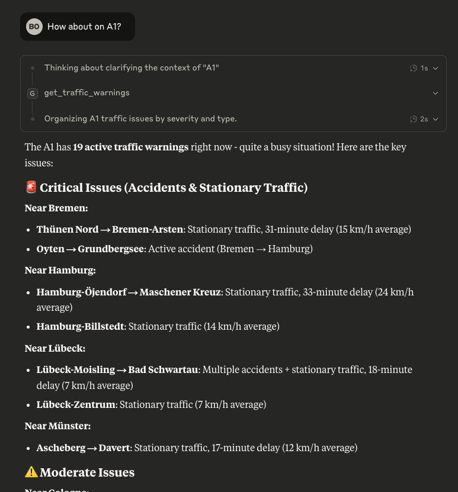

# Autobahn MCP Server

A simple Model Context Protocol (MCP) server that provides access to German Autobahn traffic data using the official [Autobahn API](https://autobahn.api.bund.dev/).

## Features

- **List Autobahns**: Get all available German highways
- **Traffic Warnings**: Real-time traffic warnings and delays  
- **Road Closures**: Current road closures and construction sites
- **Charging Stations**: Electric vehicle charging stations along routes
- **Overview**: Complete traffic status for any autobahn

## Installation

Using `uv` (recommended):

```bash
uv sync
```

## Usage



### Running the Server

```bash
python autobahn_server.py
```

Or using uv:

```bash
uv run autobahn_server.py
```

### Available Tools

- `list_autobahns()` - Get all available autobahn identifiers
- `get_traffic_warnings(autobahn)` - Traffic warnings for specific autobahn
- `get_road_closures(autobahn)` - Road closures for specific autobahn  
- `get_charging_stations(autobahn)` - EV charging stations along autobahn
- `get_autobahn_overview(autobahn)` - Complete overview of autobahn status

### Example Usage

```python
# List all autobahns
autobahns = await list_autobahns()
# Returns: ["A1", "A2", "A3", ...]

# Get traffic warnings for A1
warnings = await get_traffic_warnings("A1")
# Returns structured data with current traffic conditions

# Get complete overview
overview = await get_autobahn_overview("A7")
# Returns warnings, closures, and charging stations
```

## Integration with MCP Clients

This server works with any MCP-compatible client such as:

- Claude Desktop
- Cursor IDE
- Other MCP-enabled applications

Configure your MCP client to connect to this server using the standard MCP configuration format.

```json
{
  "mcpServers": {
    "Autobahn Server": {
      "command": "uv",
      "args": [
        "run",
        "--with",
        "mcp[cli]",
        "mcp",
        "run",
        "path/to/autobahn_mcp/main.py"
      ]
    }
  }
}
```

## Data Source

Data is provided by the German Federal Ministry for Digital and Transport via the official Autobahn API at `verkehr.autobahn.de`.

## License

MIT License
